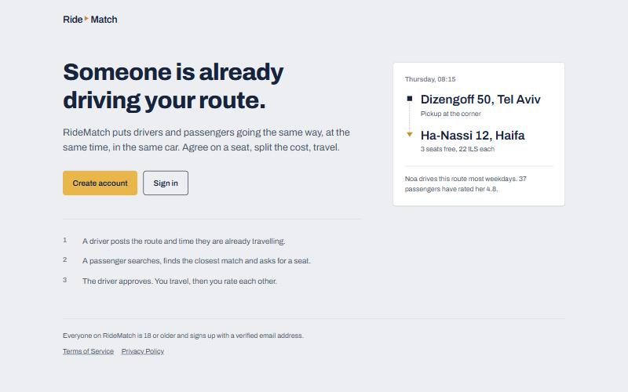
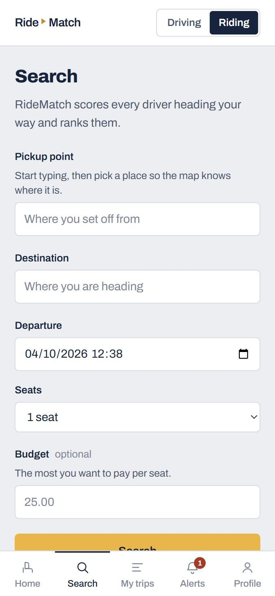
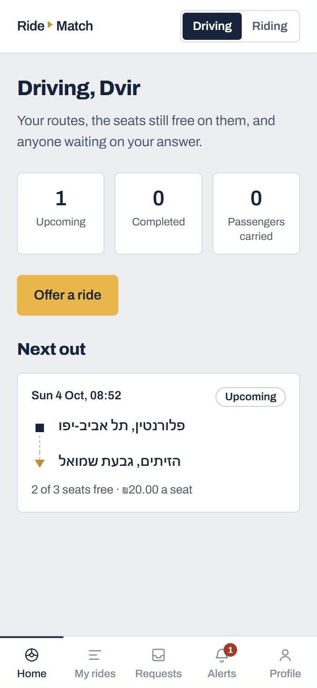
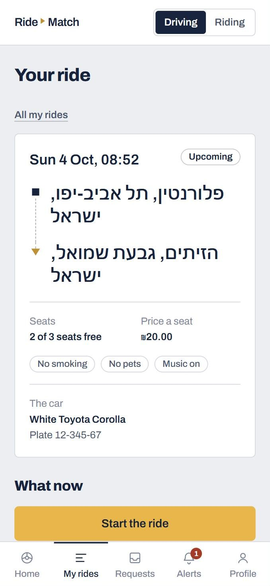
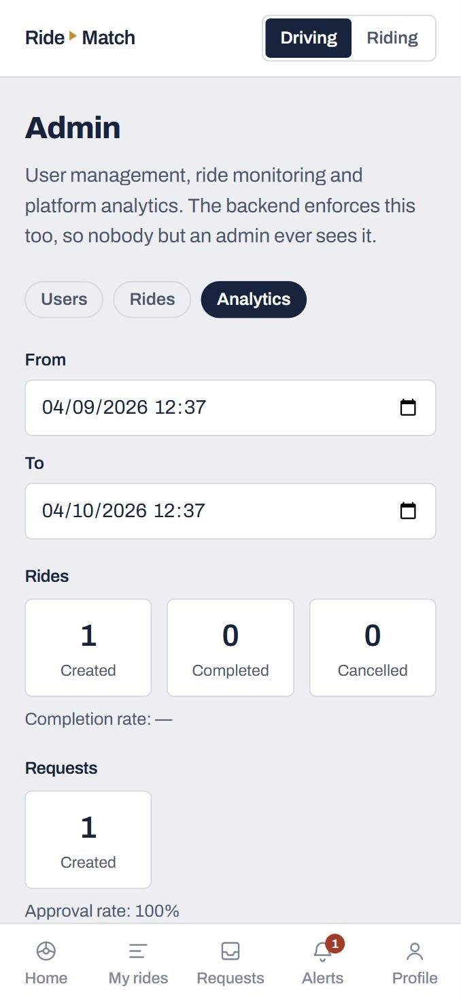
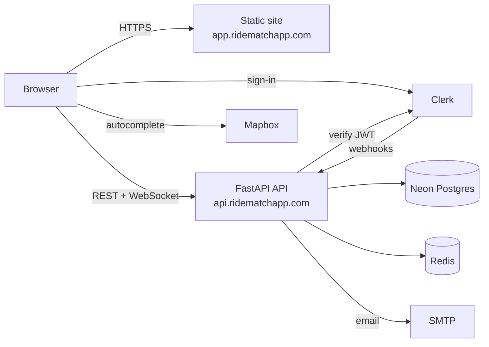

# RideMatch

**Ride-sharing for people already going your way.** Drivers post the route and time they are travelling anyway; passengers search, get ranked matches, and ask for a seat. The driver approves, they travel, then they rate each other.

**Live:** [app.ridematchapp.com](https://app.ridematchapp.com)

<p align="center">
  
</p>

<p align="center">
  
  
  
  
</p>

## Features

- **Drivers** offer rides (route, time, seats, price, smoking/pets/music preferences), approve or decline requests, start and complete the ride.
- **Passengers** search by pickup, destination and time and get results **ranked by a match score** (route distance, time, price, driver rating, preferences). They request seats, track trips and can cancel up to 1h before departure.
- **One account, two modes:** switch between Driving and Riding at any time.
- **Real-time notifications** over WebSocket, plus transactional email (welcome, approval, rejection).
- **Ratings** both ways after a completed ride.
- **Admin panel:** user management (deactivate/reactivate, synced with Clerk), ride monitoring and force-cancel, platform analytics.
- **Safety and privacy:** 18+ with verified email, the car's plate shown only to approved passengers, consistent seat accounting under concurrent approvals (row-level locking).

## Tech stack

| Layer | Stack |
|---|---|
| Frontend | React 19, TypeScript (strict), Vite, React Router, TanStack Query, Tailwind CSS |
| Backend | Python 3.12, FastAPI, SQLAlchemy 2 (async) + asyncpg, Pydantic v2, Alembic |
| Data | PostgreSQL 16, Redis (WebSocket connection registry) |
| Auth | Clerk (sign-up, email verification, JWT verified on the API, webhooks) |
| Maps | Mapbox Geocoding (address autocomplete) |
| Testing | pytest + httpx (in-process), Vitest + MSW, Playwright E2E, Schemathesis fuzzing |
| Hosting | Render (API in Docker, static frontend, Key Value), Neon Postgres, Sentry |

## Architecture



The backend is a **modular monolith**: one FastAPI process with domain modules (`users`, `rides`, `requests`, `feedback`, `notifications`, `admin`) whose calls only go one way.

The project is **contract-first**. [`contracts/openapi.yaml`](contracts/openapi.yaml) defines every endpoint and schema, [`contracts/CONTRACT.md`](contracts/CONTRACT.md) defines the behaviour (state machines, business rules, the matching formula, error codes), and the Alembic migrations define the database. The frontend's API types are generated from the OpenAPI spec, and the test suite is written against the contract rather than the backend code.

## Running locally

**Requirements:** Docker, [uv](https://docs.astral.sh/uv/), Node 20+, and free [Clerk](https://clerk.com) and [Mapbox](https://mapbox.com) development keys.

```bash
cp .env.example .env            # fill in the Clerk and Mapbox keys
docker compose up -d            # Postgres (host port 5434) + Redis

# API on :8000
cd backend
uv sync
uv run alembic upgrade head
uv run uvicorn app.main:app --reload --port 8000

# Web app on :5173 (in a second terminal)
cd frontend
npm install
npm run dev
```

Every configuration variable is documented in [`.env.example`](.env.example).

## Tests

```bash
cd tests && uv sync && uv run pytest -q          # API contract, unit and migration tests
cd frontend && npm run test -- --run             # component and hook tests (Vitest + MSW)
bash scripts/check-all.sh                        # lint, typecheck, build and tests in one go
```

The API tests run the app in-process against a real Postgres (`ridematch_test`) and check every response against the OpenAPI schema. Playwright E2E tests live in [`tests/e2e`](tests/e2e) and Schemathesis fuzzing in [`tests/fuzz`](tests/fuzz). See [`tests/README.md`](tests/README.md) for details.

## Deployment

Production runs from the [`render.yaml`](render.yaml) Blueprint: the API as a Docker web service (it runs migrations on start), the frontend as a static site with security headers, and Redis as Render Key Value. Postgres is on Neon. Pushing to `main` deploys. The step-by-step setup (Clerk production instance, DNS, SMTP, Neon, environment variables) is in [`backend/README.md`](backend/README.md#deploy-on-render).

## Project structure

```
backend/     FastAPI app, Alembic migrations, Dockerfile
frontend/    React + Vite single-page app
contracts/   OpenAPI spec, behaviour contract, reference schema
tests/       API contract tests, E2E (Playwright), fuzzing (Schemathesis)
scripts/     local check scripts
render.yaml  production infrastructure (Render Blueprint)
```

## License

[MIT](LICENSE)
