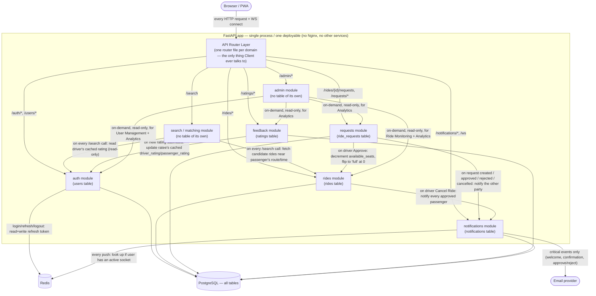

# RideMatch — System Design

*Design reference for implementation. **Architecture: monolith** — one single deployable FastAPI application (one codebase, one process, one `docker-compose` service for the app) with internal modules per domain (auth, rides, search/matching, feedback, notifications, admin) and one shared PostgreSQL database. Redis is used for sessions/refresh-token revocation and caching. There is no plan to split this into separate services — module boundaries below are just code organization (packages/folders), not deployment or network boundaries.*

---

## 1. User Flows

### 1.1 Onboarding / Auth flow
1. First launch → Welcome screen → **Sign Up** or **Sign In**
2. Sign Up: email, password, name, phone, DOB, gender, ToS checkbox → `POST /auth/register` → account created, tokens issued
3. Sign In: email + password → `POST /auth/login` → access + refresh tokens issued
4. First login (or no saved mode preference) → **Role Selection** screen → user picks Driver or Passenger → preference saved to `users.preferences.default_mode`
5. Subsequent logins land directly in the last-used mode; a **Role Switcher** in the header lets the user flip modes instantly at any time, no new login required
6. Access token expires (15 min) → client calls `POST /auth/refresh` silently using the refresh token → new access token; if refresh token is also invalid/revoked → forced back to Sign In

### 1.2 Driver flow (offering rides)
1. Driver taps **Create New Ride** → fills start/end location, departure time, seats, price, preferences (smoking/pets/music), notes → `POST /rides` → ride created with `status=upcoming`, `available_seats=capacity`
2. Ride appears in **My Rides**; driver can edit or cancel it as long as it has no approved passengers
3. A passenger requests a seat → driver gets a WebSocket push + sees it in **Requests** tab → driver taps **Approve** or **Reject**
   - Approve → `ride_requests.status=approved`, `rides.available_seats -= 1`, passenger notified; if `available_seats` hits 0, ride flips to `status=full`
   - Reject → `ride_requests.status=rejected`, passenger notified
4. On departure day, driver can mark **Start Ride** (`status=in_progress`) and later the ride auto/manually completes (`status=completed`)
5. After completion, driver is prompted to rate each passenger (1–5 stars + tags/comment) → feeds that passenger's `passenger_rating`

### 1.3 Passenger flow (requesting rides)
1. Passenger fills Search (start, end, date/time, optional budget) → `GET /search` → results scored and returned (≥40% match), sorted by best match / earliest / cheapest
2. Passenger taps a ride → Ride Details → **Request Ride** → `POST /rides/{id}/requests` → `status=pending`, driver notified
3. Passenger tracks status in **My Trips**; can **Cancel Request** while still `pending`
4. On approval/rejection, passenger gets a WebSocket + notification-feed entry
5. After the ride completes, passenger is prompted to rate the driver

### 1.4 Notifications flow
- Every state-changing event (request created, approved, rejected, ride starting in 1h, ride cancelled) writes a row to `notifications` and, if the user is connected, pushes over the WebSocket registry; email is sent for the subset marked critical (welcome, ride confirmation, approval/rejection)
- Notifications tab lists feed items, supports mark-as-read and clear-all

### 1.5 Admin flow
1. Admin logs in (same auth flow, `is_admin=true`) → sees Admin panel instead of/in addition to driver/passenger UI
2. **User Management**: search/filter users, deactivate/reactivate accounts, view a user's ride & rating history
3. **Ride Monitoring**: view all rides across the platform, filter by status, intervene on disputes (e.g. force-cancel a ride)
4. **Analytics**: aggregate counts (rides created, completion rate, average match score, active users)

---

## 2. Screens

**Auth**: Welcome · Sign Up · Sign In · Role Selection

**Driver mode** (bottom nav: Home | My Rides | Requests | Profile):
- Home — stats, "Create New Ride", today's rides, pending-requests badge, activity feed
- My Rides — list (All/Upcoming/Completed/Cancelled) → Ride Details (driver view)
- Requests — pending requests per ride, Approve/Reject
- Profile — info, driver rating, vehicle info, settings, "Switch to Passenger Mode"
- Create/Edit Ride — locations, date/time, seats, price, preferences, notes, route preview

**Passenger mode** (bottom nav: Search | My Trips | Notifications | Profile):
- Search Rides — inputs + results list (match badge, sort, filter, map toggle) → Ride Details (passenger view)
- My Trips — list (Pending/Approved/Completed/Rejected) → Trip Details
- Notifications — feed, mark read, clear all
- Profile — info, passenger rating, payment methods, trip stats, "Switch to Driver Mode"
- Rating screen (post-ride) — stars, tags, comment

**Shared/common**: Notification Settings · User Settings (edit profile, change password, privacy, language) · Help & Support

**Admin**: User Management · Ride Monitoring · Analytics

---

## 3. Database Schema

One database, tables grouped by domain. FK references assume all tables live in the same DB — if you later split services back out, these become cross-service API calls instead of FKs.

### 3.1 `users`

| Column | Type | Notes |
|---|---|---|
| id | int, PK | autoincrement |
| email | varchar(255), unique, not null | |
| password_hash | varchar(255), not null | bcrypt |
| is_admin | bool, not null, default false | |
| name | varchar(100), not null | |
| phone | varchar(20), nullable | |
| date_of_birth | date, nullable | must be 18+ at registration |
| gender | varchar(20), nullable | male / female / other / prefer_not_to_say |
| is_active | bool, not null, default true | soft-disable account |
| is_email_verified | bool, not null, default false | |
| email_verified_at | timestamptz, nullable | |
| driver_rating | float, nullable | cached average, updated by feedback module |
| driver_rating_count | int, not null, default 0 | |
| passenger_rating | float, nullable | cached average |
| passenger_rating_count | int, not null, default 0 | |
| preferences | JSON, nullable | `{default_mode, smoking, pets, notifications:{email,push,websocket}, language, theme}` |
| created_at | timestamptz, not null, default now() | |
| updated_at | timestamptz, not null, default now(), on update now() | |
| last_login_at | timestamptz, nullable | |

Refresh tokens are **not** a table — stored in Redis (`refresh_token:{user_id}` or similar) so they can be revoked on logout.

### 3.2 `rides`

| Column | Type | Notes |
|---|---|---|
| id | int, PK | |
| driver_id | int, FK → users.id, not null | |
| start_lat / start_lng | float, not null | |
| start_address | varchar(255), not null | display string |
| end_lat / end_lng | float, not null | |
| end_address | varchar(255), not null | |
| departure_time | timestamptz, not null | |
| capacity | int, not null | total seats offered |
| available_seats | int, not null | decremented on each approval |
| price_per_seat | numeric(10,2), not null | |
| status | varchar(20), not null, default `'upcoming'` | upcoming / full / in_progress / completed / cancelled |
| preferences | JSON, nullable | `{smoking, pets, music, gender_only}` — matched against passenger's preferences |
| notes | text, nullable | |
| created_at | timestamptz, not null, default now() | |
| updated_at | timestamptz, not null, default now(), on update now() | |

Index: `(start_lat, start_lng)`, `(end_lat, end_lng)`, `departure_time`, `status` — supports the search/matching queries.

### 3.3 `ride_requests`

| Column | Type | Notes |
|---|---|---|
| id | int, PK | |
| ride_id | int, FK → rides.id, not null | |
| passenger_id | int, FK → users.id, not null | |
| seats_requested | int, not null, default 1 | |
| status | varchar(20), not null, default `'pending'` | pending / approved / rejected / cancelled |
| requested_at | timestamptz, not null, default now() | |
| responded_at | timestamptz, nullable | set on approve/reject |

Unique constraint: `(ride_id, passenger_id)` — one active request per passenger per ride.

### 3.4 `ratings`

| Column | Type | Notes |
|---|---|---|
| id | int, PK | |
| ride_id | int, FK → rides.id, not null | |
| from_user_id | int, FK → users.id, not null | rater |
| to_user_id | int, FK → users.id, not null | ratee |
| role_rated | varchar(20), not null | `'driver'` or `'passenger'` — which hat `to_user_id` wore for this rating |
| score | int, not null, check 1–5 | |
| comment | text, nullable | |
| tags | JSON, nullable | e.g. `["on_time", "clean_car", "friendly"]` |
| created_at | timestamptz, not null, default now() | |

Unique constraint: `(ride_id, from_user_id, to_user_id)` — one rating per direction per ride. On insert, application code calls `User.update_rating(role, score)` to refresh the cached average on `users`.

### 3.5 `notifications`

| Column | Type | Notes |
|---|---|---|
| id | int, PK | |
| user_id | int, FK → users.id, not null | recipient |
| type | varchar(50), not null | `request_created`, `request_approved`, `request_rejected`, `ride_reminder`, `ride_cancelled`, etc. |
| title | varchar(200), not null | |
| message | text, not null | |
| related_entity_type | varchar(20), nullable | `'ride'` / `'ride_request'` |
| related_entity_id | int, nullable | |
| is_read | bool, not null, default false | |
| created_at | timestamptz, not null, default now() | |

Index: `(user_id, is_read, created_at)` for the notifications feed query.

---

## 4. System Design (Monolith)

### 4.1 The whole picture — one deployable, with every internal call shown

Everything inside the dashed boundary is **one process** (`uvicorn`, one port, one codebase) — the "modules" (`auth`, `rides`, `requests`, `search`, `feedback`, `notifications`, `admin`) are packages inside that same process, not services. Every arrow *inside* the boundary is a plain in-process Python function call, never a network hop; only the arrows crossing *out* of the boundary (to Postgres, Redis, the email provider) are real I/O. There is exactly one entry point (the router layer) — every incoming request/WS connection is dispatched to **one owning module**, which may then call into other modules' service functions directly when it needs their data or side effects.

No reverse proxy (e.g. Nginx) in local dev — with a single app there's nothing to route between. Add one only at actual deployment time, for things like TLS termination or serving the built frontend.

WebSocket connections are handled in-process (`routers/ws.py`) since it's one app — no separate notifications service needed. Redis still backs the connection registry so a future horizontal-scale (multiple app instances) wouldn't require redesigning it.

### 4.2 Who calls whom, and when — reference table

Same edges as the diagram above, as a plain table (in case Mermaid doesn't render in your viewer):

| Caller | Callee | Trigger ("when") | Direction |
|---|---|---|---|
| Router | every module | on every matching request/WS connect | 1 router → many modules, but each *request* goes to exactly one |
| `search` | `rides` | every `/search` call, to fetch candidate rides before scoring | read-only |
| `search` | `auth` | every `/search` call, to read a candidate driver's cached rating | read-only |
| `requests` | `rides` | driver taps Approve, to decrement `available_seats` | write |
| `requests` | `notifications` | request created / approved / rejected / cancelled | write (fire notification) |
| `rides` | `notifications` | driver cancels a ride with approved passengers | write (fire notification) |
| `feedback` | `auth` | a rating is submitted, to refresh the ratee's cached average | write |
| `admin` | `auth`, `rides`, `requests`, `feedback` | admin opens User Management / Ride Monitoring / Analytics screens | read-only |
| `auth` | Redis | login, refresh, logout | write/read (refresh token) |
| `notifications` | Redis | any notification, to check if the user is connected | read |
| `notifications` | Email provider | only the critical-events subset | write (external) |

Note the asymmetry: `rides`, `requests`, and `feedback` never call `search` or `admin` back — dependencies only flow "inward" toward `auth`/`rides`/`notifications`, so there's no call cycle between modules. `search` and `admin` are pure *consumers* of other modules; they own no table and nothing calls into them except the router.

**Verified DAG.** Every edge above was checked and the graph is acyclic — a valid topological order is:

`Router → Admin → Search → Requests → Feedback → Rides → Auth → Notifications → {Redis, Email, PostgreSQL}`

Every arrow in §4.1 points strictly forward in that order (e.g. `Admin → Feedback → Auth` and `Requests → Rides → Notifications` both move left-to-right, never back), so there is no path that returns to a module already visited. This matters in practice: it means no module's service functions can end up in a circular-import or circular-call situation with another, which is the main risk that creeps in once "just call the other module directly" becomes the norm in a monolith.

### 4.3 Core service functions (per module)

**`auth_service`**
- `email_exists(db, email) -> bool`
- `get_user_by_email(db, email) -> User | None`
- `get_user_by_id(db, user_id) -> User | None`
- `register_user(db, user_data: UserCreate) -> User` — raises `EmailAlreadyExistsError`
- `authenticate_user(db, email, password) -> User` — raises `AuthenticationError`, updates `last_login_at`
- `update_user_profile(db, user, update_data: UserUpdate) -> User`

**`jwt_service`**
- `create_access_token(user_id) -> str` (15 min expiry)
- `create_refresh_token(user_id) -> str` (7 day expiry, stored in Redis)
- `decode_access_token(token) -> TokenData` — raises on invalid/expired
- `revoke_refresh_token(user_id)` — on logout

**`rides_service`**
- `create_ride(db, driver_id, ride_data: RideCreate) -> Ride`
- `get_ride(db, ride_id) -> Ride | None`
- `update_ride(db, ride, update_data: RideUpdate) -> Ride` — blocked if approved passengers exist for location/time changes
- `cancel_ride(db, ride) -> Ride` — sets `status=cancelled`, triggers notifications to approved passengers
- `list_rides_for_driver(db, driver_id, status_filter=None) -> list[Ride]`
- `get_active_rides_near(db, lat, lng, radius_km, after=None, before=None) -> list[Ride]` — the query `search` calls into
- `decrement_available_seats(db, ride) -> Ride` — called on request approval; flips `status='full'` at 0
- `start_ride(db, ride) -> Ride` / `complete_ride(db, ride) -> Ride`

**`requests_service`**
- `create_request(db, ride_id, passenger_id, seats=1) -> RideRequest` — enforces the unique `(ride_id, passenger_id)` constraint, rejects if ride is full/not upcoming
- `approve_request(db, request) -> RideRequest` — calls `rides_service.decrement_available_seats`, enqueues notification
- `reject_request(db, request) -> RideRequest` — enqueues notification
- `cancel_request(db, request) -> RideRequest` — passenger-initiated, only while `pending`
- `list_requests_for_ride(db, ride_id) -> list[RideRequest]`
- `list_requests_for_passenger(db, passenger_id, status_filter=None) -> list[RideRequest]`

**`matching_service`** — the core algorithm
- `haversine_km(lat1, lng1, lat2, lng2) -> float`
- `score_route(passenger_start, passenger_end, ride) -> float` (0–40)
- `score_time(passenger_time, ride.departure_time) -> float` (0–25, decays outside ±2h window)
- `score_price(passenger_budget, ride.price_per_seat) -> float` (0–15)
- `score_rating(driver_rating) -> float` (0–10, full points at 4.5+)
- `score_preferences(passenger_prefs, ride.preferences) -> float` (0–10, hard-fails to 0 on a critical mismatch like gender-only)
- `calculate_match_score(passenger_search, ride) -> float` — sums the above
- `search_rides(db, search_params: SearchQuery) -> list[RideMatch]` — calls `rides_service.get_active_rides_near`, scores each, filters `≥40`, sorts by requested order (best match / earliest / cheapest)

**`feedback_service`**
- `create_rating(db, ride_id, from_user_id, to_user_id, role_rated, score, comment=None, tags=None) -> Rating` — enforces one-per-direction-per-ride, calls `User.update_rating(...)` on the ratee
- `list_ratings_for_user(db, user_id, role_rated=None) -> list[Rating]`

**`notifications_service`**
- `create_notification(db, user_id, type, title, message, related_entity_type=None, related_entity_id=None) -> Notification`
- `mark_read(db, notification) -> Notification` / `mark_all_read(db, user_id)`
- `list_notifications(db, user_id, unread_only=False) -> list[Notification]`
- `push_ws(user_id, payload)` — looks up the connection registry (Redis) and sends if the user has an active socket
- `send_email(to, template, context)` — for the critical-events subset

**`admin_service`**
- `list_users(db, filters) -> list[User]` / `deactivate_user(db, user)` / `reactivate_user(db, user)`
- `list_rides(db, filters) -> list[Ride]` / `force_cancel_ride(db, ride, reason)`
- `get_analytics_summary(db, date_range) -> AnalyticsSummary` — rides created, completion rate, avg match score, active users

### 4.4 Request-time flow examples

**Passenger searches:**
`GET /search?start_lat=..&start_lng=..&end_lat=..&end_lng=..&time=..&budget=..`
→ `search.router` → `matching_service.search_rides(db, params)` → internally calls `rides_service.get_active_rides_near(...)` → scores each candidate → returns sorted `RideMatch[]` (ride + score + driver's cached rating, no extra network hop since it's all in-process).

**Driver approves a request:**
`POST /requests/{id}/approve` → `requests_service.approve_request(db, request)` → `rides_service.decrement_available_seats(db, ride)` → `notifications_service.create_notification(...)` + `push_ws(passenger_id, ...)` → response returns updated `RideRequest`.

---

## 5. Open items before/while implementing

- Confirm final table placement: one schema vs. per-module schemas in the same DB (cosmetic now, easy to change later since it's one DB either way)
- Decide seat-counting concurrency handling (e.g. `available_seats` decrement under a row lock / `SELECT ... FOR UPDATE`) once concurrent requests are a real scenario
- Email sending mechanism (SMTP provider) not yet chosen — stub it behind `notifications_service.send_email` so it's swappable
